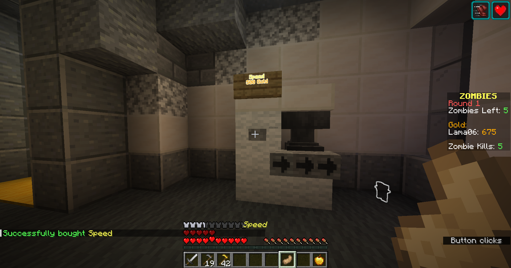

# Zombies Plugin

## Features
- A lot of different zombie types and attacks (melee, laser, fireball, explosion)
- Very easy to get started: Dead End map and configuration provided (see below)
- Perks (speed, extra health, quick fire, frozen bullets, extra weapon etc.)
- Collectable perks dropped by zombies (instant kill, full ammo, double gold)
- Several different weapons (rifle, shotgun, sniper, flamethrower etc.)
- Animated lucky chests
- Highly configurable using inventory UIs: door, windows, shops etc.
- Support for custom maps
- Commands to give yourself gold, weapons, summon zombies etc.
- Armor shops
- Power switch
- Team machine
- No usage of NMS: the plugin probably won't break with new Minecraft versions
- ...

## Showcase

## Getting started

- Download the plugin's latest version from [GitHub](https://github.com/Lama06/Zombies-Plugin/releases/latest).
- Download the [Dead End map](https://github.com/Lama06/Zombies-Plugin/releases/tag/world) and add it to your server:
  - Either delete your server's world directory and replace it with the Dead End world
  - or use a world management plugin to add it to your server.
- Join the server, enter the world you added and execute `/zombies loadTemplate` to load the default configuration for Dead End.
- Use `/zombies start` to start a game and `/zombies stop` to stop a game.
- Have fun!